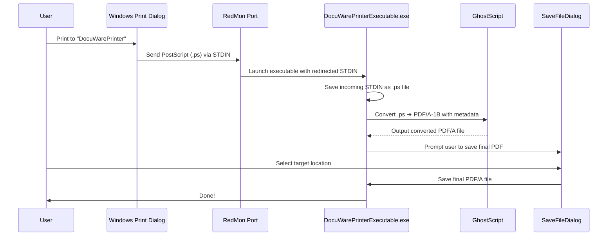

# 📄 DocuWare Printer PoC

Proof of Concept (**PoC**) for a **DocuWare Virtual Printer** system using **.NET 8**, **GhostScript**, and **RedMon**.

---

## 1. 📚 Project Structure

| Project | Description |
|:---|:---|
| **DocuWarePrinterPoC** | Console app that converts `.xps` files to **PDF/A-1B** format using GhostScript |
| **DocuWarePrinterExecutable** | Console app triggered by a virtual printer installed via RedMon, handling **PostScript (.ps)** input, converting it to **PDF/A-1B**, and asking the user to save |

---

## 2. ✨ Achievements

🔝 Built a **Windows 11 compatible** printing flow (no Win32 dialog dependency)  
🔝 Replaces broken Soft-Expansion SDK  
🔝 Supports **PDF/A-1B** output (required for compliance)  
🔝 Full **metadata injection** (Author, Title, Subject, Keywords) into generated PDFs  
🔝 Works on **Terminal Server environments** (retrieves Windows SID)  
🔝 **Filename** and **DropFolder** customizable (from Registry or fallback path)  
🔝 **No console window** shown when running (professional RedMon integration)  
🔝 **Royalty-free components** only (PdfSharp.Xps, GhostScript CLI)  
🔝 **Memory optimization** for x86 large files (GhostScript flags `-dBufferSpace`, `-dMaxBitmap`)  
🔝 Silent file processing (no user prompts unless needed except SaveFileDialog)

---

## 3. ⚙️ Technical Stack

| Technology | Purpose |
|:---|:---|
| .NET 8 (Windows target) | Core application framework |
| PdfSharp.Xps | Convert `.xps` files to `.pdf` (MIT license) |
| GhostScript (CLI) | Convert `.ps` to `.pdf` and ensure PDF/A-1B compliance |
| RedMon (Redirected Port Monitor) | Connect virtual printer output to custom console app |

---

## 4. 🔥 Full Workflow

### 📁 DocuWarePrinterPoC (.xps ➔ .pdf/a-1b)
- Input `.xps` file from a configured drop folder.
- Converts `.xps` to simple `.pdf`.
- Converts `.pdf` to **PDF/A-1B** using GhostScript.
- Injects document metadata.
- (Optional) Sends resulting PDF to the printer.

---

### 🖨 DocuWarePrinterExecutable (.ps ➔ .pdf/a-1b)
- Captures raw printer output (`stdin`) as `.ps` file.
- Immediately converts `.ps` to **PDF/A-1B** using GhostScript.
- Opens a Save As dialog where user selects where to save the converted PDF.

---

## 5. 📈 DocuWare Printer Flow Diagram

---

## 6. 🔗 References

| Resource | Link |
|:---|:---|
| [GhostScript Download](https://ghostscript.com/releases/gsdnld.html) | Generate PDF/A output |
| [RedMon Port Monitor](http://www.ghostgum.com.au/software/redmon.htm) | Redirect port to executable |
| [Configure RedMon Virtual Printer](https://stackoverflow.com/questions/10403805/configure-virtual-printer-port-redirection) | Setup instructions |
| [Microsoft Print Support App Design Guide](https://learn.microsoft.com/en-us/windows-hardware/drivers/devapps/print-support-app-design-guide) | Architecture reference |